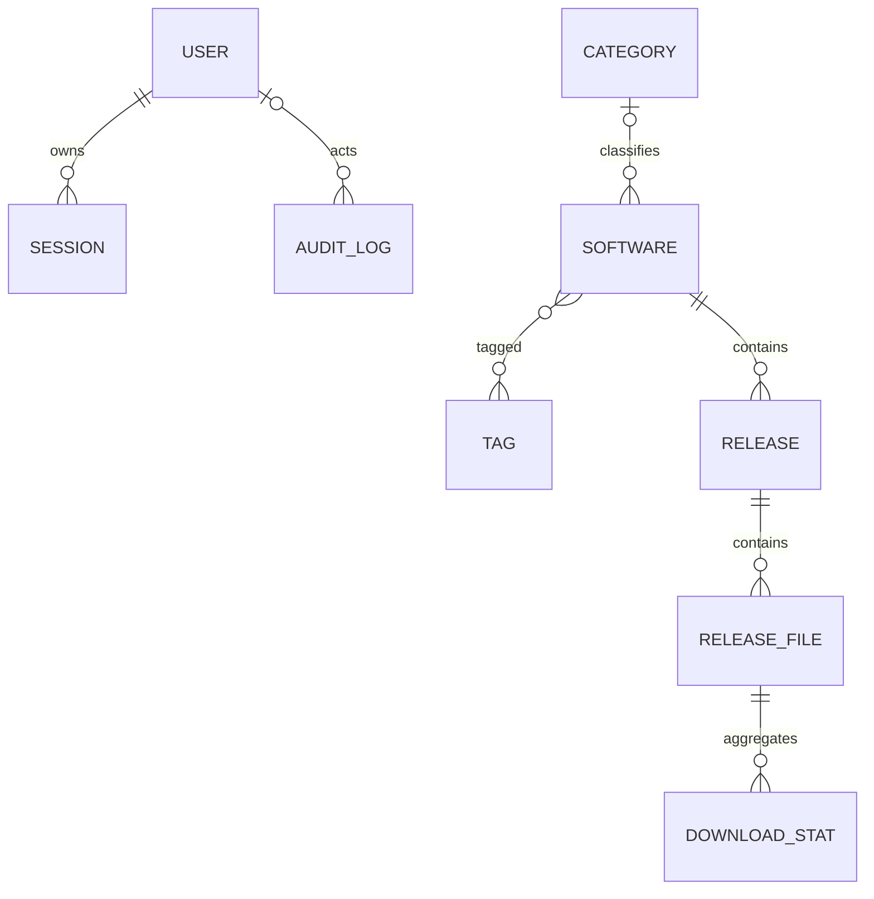

# Software Hub data model

**Phase:** 4  
**Migration head:** `0002_phase4_domain_schema`

## Overview

The MVP schema keeps binary files outside SQLite. The database stores identity,
metadata, lifecycle state, aggregate statistics and safe audit records.

## Identity strategy

- Internal relational entities use integer primary keys.
- `ReleaseFile.public_uuid` is the only public file identifier.
- Physical paths are not identifiers and must never be accepted from clients.
- Usernames and slugs are normalized by the application service before insert;
  database uniqueness protects the persisted normalized value.

## Tables

### `users`

Manually provisioned administrator accounts.

Important constraints and indexes:

- unique indexed `username`;
- non-negative `failed_login_attempts`;
- password material is represented only by `password_hash`;
- account state, lockout timestamps and password/login timestamps are retained.

### `sessions`

Server-side sessions. The raw random token is never stored in the database.

Important constraints and indexes:

- unique indexed `session_token_hash`;
- cascade delete when the owning user is deleted;
- indexes for user expiry and revoked-session cleanup;
- optional hashed user-agent and IP metadata;
- session-bound CSRF secret hash.

### `categories`

Sortable public catalog categories.

- unique indexed slug;
- non-negative sort order;
- deleting a category sets `software.category_id` to `NULL` rather than deleting
  software.

### `tags` and `software_tags`

Tags use a composite-primary-key association table.

- tag slug is unique;
- association rows cascade when either side is deleted;
- deleting a tag never deletes software.

### `software`

Top-level catalog entries.

- unique indexed slug;
- indexed name, status, visibility, category and featured/update combinations;
- validated string enums for lifecycle status and visibility;
- category uses `ON DELETE SET NULL`;
- releases cascade only when explicit software metadata deletion occurs.

### `releases`

Version/channel records owned by software.

- unique `(software_id, version, release_channel)`;
- partial unique index permits only one current stable release per software;
- beta, alpha and other channels may independently be marked current;
- release files cascade when release metadata is explicitly deleted.

The service layer in Phase 5 remains responsible for valid lifecycle
transitions and atomically replacing the current stable release. The database
index is a final consistency barrier.

### `release_files`

Metadata for a binary stored outside the database.

- unique public UUID;
- unique server-generated storage filename and relative storage path;
- indexed SHA-256 for duplicate discovery, but duplicate content is not rejected
  automatically at database level;
- SHA-256 length must be 64 characters;
- file size and download count must be non-negative;
- validated enums for architecture, package type, state, visibility, signature
  and scanner state;
- release deletion cascades file metadata and daily statistics.

`relative_storage_path` is server-generated metadata. It must never be built
from a client-supplied absolute path.

### `download_stats`

Daily privacy-preserving aggregate counters.

- unique `(release_file_id, date)`;
- all counters must be non-negative;
- no permanent raw IP address is stored;
- rows cascade when file metadata is explicitly deleted.

### `audit_logs`

Append-only safe metadata for administrative and security-sensitive actions.

- user deletion sets `user_id` to `NULL` so history survives;
- indexed timestamp, action, user/timestamp and entity fields;
- JSON metadata is allowlist-oriented and must not contain secrets;
- request ID and optional hashed IP support correlation without storing raw
  sensitive values.

## Enum persistence

SQLAlchemy enums are configured with:

- string values rather than Python member names;
- `native_enum=False` for SQLite and migration portability;
- generated check constraints;
- runtime validation of unexpected strings.

## Timestamp policy

All application datetimes use `UTCDateTime`:

- timezone-aware values are required on write;
- values are normalized to UTC;
- SQLite values are restored with explicit UTC timezone information;
- creation/update timestamps have portable database defaults;
- business timestamps remain nullable until the associated transition occurs.

## Delete policy

Database cascades protect relational consistency but do not authorize a delete.
Later services must still implement archive, disable, metadata delete and
permanent file deletion as separate explicit operations.

| Parent action | Database result |
|---|---|
| Delete user | Sessions deleted; audit user reference set to null |
| Delete category | Software retained; category reference set to null |
| Delete tag | Association rows deleted; software retained |
| Delete software | Releases, release files, stats and tag associations deleted |
| Delete release | Release files and stats deleted |
| Delete release file metadata | Daily stats deleted |

Physical software files are never removed by an ORM cascade. Filesystem changes
belong to the storage/application services introduced in later phases.

## PostgreSQL migration path

The model avoids SQLite-only business SQL. Portable SQLAlchemy types, named
constraints and string enums are used throughout. The current-stable partial
index includes both SQLite and PostgreSQL predicates. A future PostgreSQL move
will still require a tested migration, but not a rewrite of the domain model.
